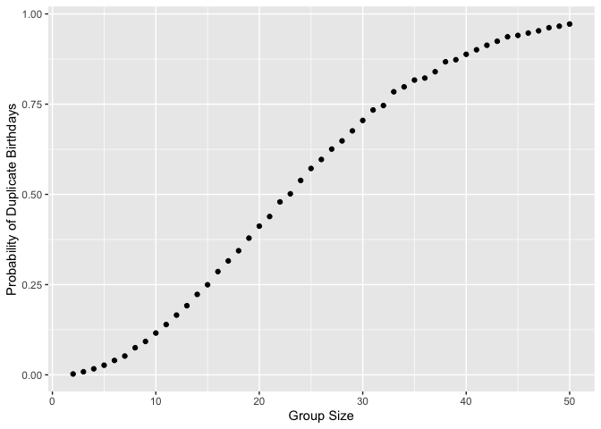
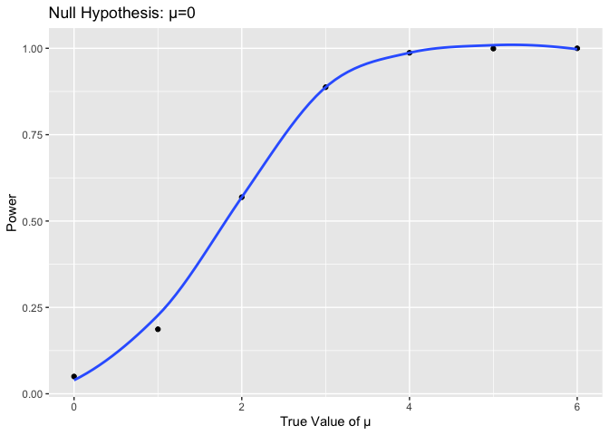
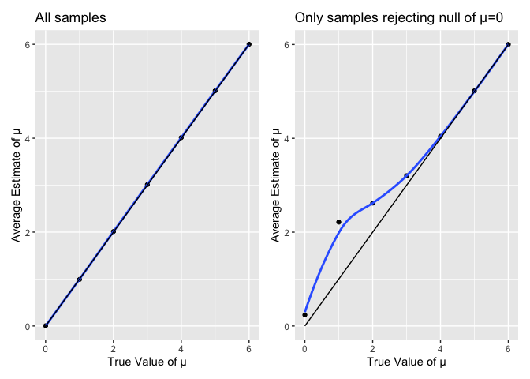

Homework 5
================
Riyadh Baksh
2024-11-15

## Problem 1

The plot below shows that in general, the probability of having two
people with the same birthday increases as the group size increases. The
probability increase rate is faster as the group size increases from
small sizes, but flattens out as the group size gets larger.

``` r
library(tidyverse)
library(rvest)

set.seed(1)

bday = function(n) {
  days = sample(1:365,size=n,replace=TRUE)
  decision=FALSE
  for (i in 1:n) {
    for (j in 1:n) {
      if (i!=j) {
        if (days[i]==days[j]){
          decision=TRUE
        }
      }
    }
  }
  decision
}

prob = vector("numeric",length=49)

for (n in 2:50) {
  output = vector("numeric",length=10000)
  for (i in 1:10000) {
    output[i] = bday(n)
  }
  prob[n-1] = mean(output)
}

ggplot(mapping=aes(x=2:50,y=prob)) +
  geom_point() +
  xlab("Group Size") +
  ylab("Probability of Duplicate Birthdays")
```

<!-- -->

## Problem 2

``` r
normal = function(u) {
  result=tibble(estimate=numeric(),p.value=numeric(),true=numeric())
  for (i in 1:5000){
    x = rnorm(30,mean=u,sd=5)
    test = broom::tidy(t.test(x))
    result = add_row(result,
                     estimate=as.numeric(test[1]),
                     p.value=as.numeric(test[3]),
                     true=u)
  }
  result
}

values = tibble(estimate=numeric(),p.value=numeric(),true=numeric())

for (u in 1:6){
  result=normal(u)
  values = add_row(values, result)
}
```

``` r
data =
  values |>
  mutate(test=p.value<=0.05)

data |>
  group_by(true) |>
  summarize(
    power = mean(test)
  ) |>
  ggplot(aes(x=true,y=power)) +
    geom_point() +
    xlab("True Value of μ") +
    ylab("Power") +
    ggtitle("Null Hypothesis: μ=0")
```

<!-- -->

``` r
data |>
  filter(test==TRUE) |>
  group_by(true) |>
  summarize(
    average = mean(estimate)
  ) |>
  ggplot(aes(x=true,y=average)) +
    geom_point() +
    xlab("True Value of μ") +
    ylab("Average Estimate of μ") +
    ggtitle("Null of μ=0 was rejected")
```

<!-- -->

## Problem 3
